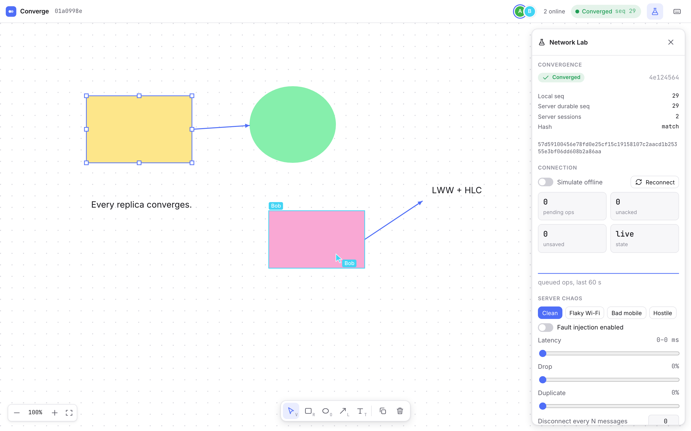

# Converge

Converge is a multiplayer whiteboard where the network is allowed to be
terrible. Open a document in two browsers and draw: edits show up on the other
side in a few milliseconds. Now pull the plug on one of them. Keep drawing,
reload the tab, close it, come back an hour later on a connection that drops a
third of its packets and duplicates the rest. When it reconnects, both sides
end up with byte-for-byte the same document, and the app can prove it: every
client and the server hash their state, and the numbers match.

That guarantee is the whole project. It comes from a small custom CRDT-style
engine where the document is a pure function of the *set* of edits it has
seen, so order, duplication and delay cannot change the result. The same
engine and sync protocol are written twice, in Rust for the server and
TypeScript for the browser, and kept identical by shared fixtures. To be sure
they hold up, the protocol runs inside a deterministic simulator that injects
latency, drops, reordering, clock skew and crashes across thousands of seeded
runs, and the real server has a built-in chaos mode you can switch on from
the UI. The drawing tools are simple on purpose; the interesting part is
underneath them.



- [`docs/ARCHITECTURE.md`](docs/ARCHITECTURE.md) — design of the engine, protocol, server and client
- [`docs/INVARIANTS.md`](docs/INVARIANTS.md) — correctness invariants, how they are tested, and the bugs the simulator found

## How it works

- Every edit is an operation with a hybrid logical clock timestamp. Document
  state is a set of last-writer-wins registers, so applying the same set of
  ops in any order, any number of times, gives the same result. Convergence
  is checked by hashing the canonical state.
- The server assigns sequence numbers and persists ops to Postgres, but never
  arbitrates conflicts. Clients get an ack only after the op is durable.
- The server hub and the client sync engine are sans-I/O state machines. The
  same code runs behind Tokio/WebSockets in production and inside a
  deterministic discrete-event simulator that injects latency, drops,
  duplicates, reordering, clock skew and crashes.
- The engine and sync engine are implemented twice, in Rust and TypeScript.
  Fixtures generated by the Rust side are replayed by the TypeScript tests so
  the two cannot drift.

**Stack:** Rust (axum, tokio, sqlx, prost), TypeScript (React, Vite,
protobuf-es, idb), Postgres, Prometheus, Playwright.

## Layout

| path                          | what                                                                       |
| ----------------------------- | -------------------------------------------------------------------------- |
| `crates/converge-core`        | document engine: ids, HLC, LWW registers, fractional indexing, state hash |
| `crates/converge-proto`       | protocol messages, JSON form, protobuf wire codec                          |
| `crates/converge-hub`         | per-document server state machine                                          |
| `crates/converge-client-sync` | reference client state machine (pending queue, resume, re-timestamping)    |
| `crates/converge-sim`         | deterministic simulator, fault model, named scenarios, invariant checks    |
| `crates/converge-storage`     | `Storage` trait with Postgres and in-memory implementations                |
| `crates/converge-server`      | axum server: WebSocket sessions, document actors, persister, chaos, metrics |
| `web/packages/engine`         | TypeScript port of the engine, checked against `fixtures/engine`           |
| `web/packages/protocol`       | TypeScript messages and protobuf codec, checked against `fixtures/wire.json` |
| `web/packages/sync`           | TypeScript sync engine (checked against `fixtures/sync`), IndexedDB store, client |
| `web/apps/canvas`             | React canvas app and Playwright tests                                      |
| `proto/`                      | protobuf schema                                                            |
| `deploy/`                     | Dockerfile and docker-compose (Postgres, server, Prometheus)               |

## Running it

Requires a Rust toolchain, Node 22 and pnpm.

```sh
# server on :8080 (in-memory storage; set DATABASE_URL=postgres://… for Postgres)
cargo run -p converge-server

# web app with hot reload, proxied to the server
cd web && pnpm install && pnpm --filter @converge/canvas dev
```

Open http://localhost:5173. A new document is created and its id is put in the
URL; open the same URL in another tab or browser to collaborate.

Or run the whole stack with Docker: `docker compose -f deploy/docker-compose.yml up --build`
(app on :8080, Prometheus on :9090).

Useful endpoints: `GET /docs/:id/hash` (durable state hash), `PUT /admin/chaos`
(`{"enabled":true,"latency_ms":[5,120],"drop_p":0.1,"dup_p":0.1,"disconnect_every":20}`),
`GET /metrics`.

## The app

Rectangles, ellipses, arrows and text; drag, resize, duplicate, z-order,
multi-select, zoom and pan, inline text editing, keyboard shortcuts (`?`).
Remote cursors and selections are shown in each user's colour.

The **Network Lab** panel (flask icon, or `⌘.`) shows the local and server
state hashes, the durable sequence number, the size of the pending queue, a
simulated-offline switch, server-side chaos presets (Clean / Flaky Wi-Fi / Bad
mobile / Hostile) with individual latency, drop, duplicate and disconnect
controls, and live latency numbers.

## Benchmarks

`pnpm bench` (in `web/apps/canvas`) runs N headless clients against a server:

```sh
pnpm bench --url http://127.0.0.1:8080 --clients 10 --ops 200 [--chaos clean|flaky|hostile] [--json bench/results/run.json]
```

Numbers from a MacBook Pro with in-memory storage; all clients converged in
both runs:

| run                                                                                          | commit latency p50 / p95 | throughput | reconnects     | drain to converged |
| -------------------------------------------------------------------------------------------- | ------------------------ | ---------- | -------------- | ------------------ |
| 10 clients × 200 ops, clean                                                                  | 8 / 16 ms                | ~600 ops/s | 0              | 3.3 s              |
| 10 clients × 200 ops, hostile (30 % drop, 30 % dup, 50–400 ms latency, disconnect every 15 msgs) | 6.1 / 50 s               | ~35 ops/s  | 52 (p50 555 ms) | 60 s               |

## Tests

```sh
cargo test --workspace --release                 # engine, hub, client, simulator, storage, server
SIM_SEEDS=200 cargo test --release -p converge-sim
cargo run --release -p converge-sim -- --scenario everything --seed 7   # reproduce one run
cd web && pnpm -r test                           # fixture conformance, trace replay, IndexedDB crash windows
cd web/apps/canvas && pnpm exec playwright test  # builds the app, starts the server, drives 2–3 browsers under chaos
```

To regenerate the cross-language fixtures after an engine change:
`cargo test -p converge-core --test fixtures -- --ignored generate`,
`cargo test -p converge-proto --test wire -- --ignored generate`, and the
commands in `fixtures/sync/README.md`.
